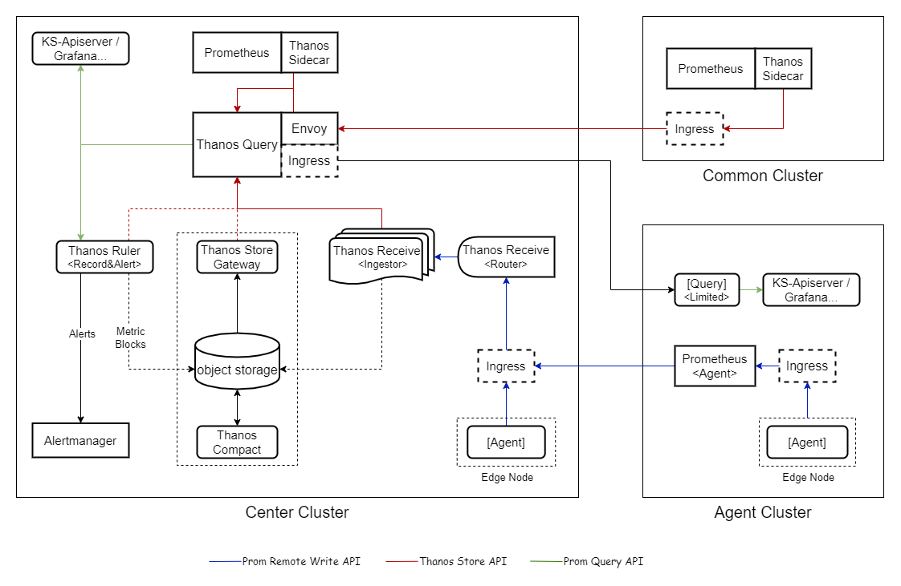

# PaodinMonitoring

PaodinMonitoring provides an optimized multi-cluster monitoring solution based on prometheus(server/agent) and thanos.

## Design




The PaodinMonitoring runs on multiple clusters, writes metrics to or querys metrics from other clusters.


## CRDs

PaodinMonitoring contains an operator that acts on the following CRDs to deploy some key components: 

- `ThanosQuery`, which defines a desired thanos query deployment. The operator will inject an envoy sidecar container to it, which proxies query requests requiring auth to secure stores.
- `ThanosReceive`, which defines a desired thanos receive deployment.
- `ThanosStorage`, which defines two desired deployments: thanos store gateway, thanos compact. An object storage usually requires a thanos store gateway component to provide metrics query apis, and a thanos compact component to compact metrics block and do metrics lifecycle management, so define them in one CRD.

To learn more about them have a look at the [api doc](docs/api.md).

## QuickStart

Install the CRDs and the PaodinMonitoring Operator:

```shell
kubectl apply -f https://raw.githubusercontent.com/kubesphere/paodin-monitoring/master/config/bundle.yaml
```

1. Deploy thanos receive in ingestor mode, which will ingest samples, land them into local tsdb and, if configured, shipper local blocks to the object store.

  ```shell
  cat <<EOF | kubectl apply -f -
  apiVersion: monitoring.paodin.io/v1alpha1
  kind: ThanosReceive
  metadata:
    name: ingestor
  spec:
    replicas: 2
    ingestor:
      dataVolume:
        pvc:
          spec:
            resources:
              requests:
                storage: 5Gi
  EOF
  ```

2. Deploy thanos receive in router mode, which will receive remote-write requests wrapping samples from in-cluster or out-cluster services, and then dispatch them to the ingestors above.

  ```shell
  cat <<EOF | kubectl apply -f -
  apiVersion: monitoring.paodin.io/v1alpha1
  kind: ThanosReceive
  metadata:
    name: router
  spec:
    replicas: 2
    router:
      softTenantHashring:
        name: test
        endpointsSelector:
          matchLabels:
            "app.kubernetes.io/component": "thanosreceive"
            "app.kubernetes.io/instance": "ingestor"
            "thanos.receive/ingestor": "true"
  EOF
  ```

3. Deploy thanos query component to query the ingestors above. Prometheus with a thanos sidecar deployed to expose store apis may also be added to query.

  ```shell
  cat <<EOF | kubectl apply -f -
  apiVersion: monitoring.paodin.io/v1alpha1
  kind: ThanosQuery
  metadata:
    name: sample
  spec:
    stores:
      - address: dnssrvnoa+_grpc._tcp.thanosreceive-ingestor-operated
  EOF
  ```

## Roadmap

- [x] Define CRDs to configure and deploy thanos components: query, receive, store gateway, compact.
  
  > It must be a singleton for thanos compact which will read and write to an object store)
- [x] Add ingress configurations for http server and grpc server of thanos query, remote-write server of thanos receive
- [x] Add configuration of envoy sidecar which is used to proxy query requests to the secure stores.
- [x] Optional running mode configuration to the CRD for thanos receive: router, ingestor.
- [x] Automatically discovers thanos receive ingestor endpoints (by endpoint selector) for thanos receive router.
- [x] Configure soft and hard tenants separately and clearly for thanos receive router hashring.
- [ ] Add more configurable items to CRDs for configuring individual components flexibly.
- [ ] Add support for enabling component metrics export, which requires the operator to create service monitors.
- [ ] Define CRD to configure to deploy open telemetry collector to edge nodes, which collects metrics data in edge nodes.
  > [opentelemetry-operator](https://github.com/open-telemetry/opentelemetry-operator) only supports assigning scrape configuration string to its CRD configuration item.
- [ ] Federalize alert rules for multiple clusters. Compatibility with `PrometheusRule` defined by prometheus-operator has to be considered.